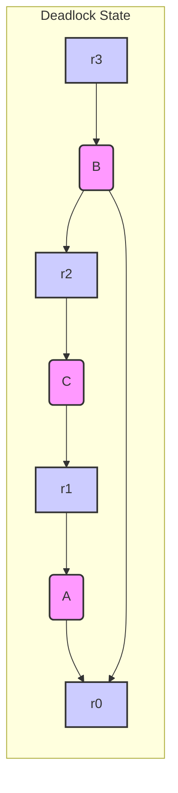

## Resource Allocation Graph and Deadlock Analysis for `Deadlock.java`

Based on the provided `Deadlock.java` code, which demonstrates a potential deadlock scenario using threads and `synchronized` blocks for resource locking, here's a detailed analysis and the corresponding resource allocation graph.

**Code Summary:**

*   **Resources:** The `Semaphore` array `mutex[]` (effectively treated as simple locks due to the use of `synchronized`) represents four resources: `resource[0]`, `resource[1]`, `resource[2]`, and `resource[3]`.
*   **Threads:** Three threads (`A`, `B`, and `C`) are created and started.
*   **Locking:** Each thread attempts to acquire locks on specific resources using nested `synchronized` blocks. The order of locking is critical in determining if a deadlock occurs.
* **Synchronized:** While semaphores are instantiated, their functionality is effectively bypassed by `synchronized`. Thus, each semaphore acts as a simple lock.

**Identifying the Locking Order**

*   **Thread A:**
    1.  Locks `resource[1]`
    2.  Then attempts to lock `resource[0]`
*   **Thread B:**
    1.  Locks `resource[3]`
    2.  Then attempts to lock `resource[0]`
    3.  Then attempts to lock `resource[2]`
*   **Thread C:**
    1.  Locks `resource[2]`
    2.  Then attempts to lock `resource[1]`

**Potential Deadlock Scenario**

Let's trace a sequence of events that can lead to a deadlock:

1.  **Thread A** executes and locks `resource[1]`.
2.  **Thread B** executes and locks `resource[3]`.
3.  **Thread C** executes and locks `resource[2]`.
4.  **Thread A** attempts to lock `resource[0]`. This resource is currently free, so thread A succeeds, and locks resource[0]
5. **Thread B** now attempts to lock `resource[0]`. However `resource[0]` is locked by thread A. **Thread B is now blocked**, waiting for `resource[0]` to be released.
6.  **Thread C** now attempts to lock `resource[1]`. However `resource[1]` is locked by Thread A. **Thread C is now blocked**, waiting for `resource[1]` to be released.

**Resource Allocation Graph:**

We use the following conventions:

*   **Circles:** Represent threads (A, B, C).
*   **Squares:** Represent resources (r0, r1, r2, r3).
*   **Directed Edge (Resource -> Thread):** Resource is allocated to the thread.
*   **Directed Edge (Thread -> Resource):** Thread is requesting (waiting for) the resource.

**Possible Scenario Leading to a Deadlock**
Let's imagine this sequence of events:

1. Thread A locks resource[1].
2. Thread C locks resource[2].
3. Thread A tries to lock resource[0], it hasn't been locked yet. It succeeds
4. Thread B locks resource[3]
5. Thread B tries to lock resource[0]. Thread B is blocked.
6. Thread C tries to lock resource[1]. Thread C is blocked.

**Resource Allocation Graph in that deadlock Scenario**

**Explanation of the Graph**
1. r1 has been allocated to A, and A is requesting r0
2. r2 has been allocated to C, C is waiting for r1
3. r3 has been allocated to B, B is blocked waiting for r0, and is also requesting r2.
4. r0 is allocated to A, and is thus not available for B

**Deadlock Detection in the Graph:**
* Circular Wait: A circular wait condition exists.
    - C is waiting for R1, A has R1.
    - B is waiting for R0 and R2. A has R0, and C has R2.
    - A has R0, preventing B from proceeding.
* Hold and Wait: Each thread is holding a resource while waiting for another.
* No Preemption: The threads cannot take resources from one another.
* Mutual Exclusion: Only one thread can hold a resource at a time.

### Conclusion
The resource allocation graph clearly shows the potential for a deadlock. Thread A holds resource[1] and is requesting resource[0]. Thread B holds resource[3] and is requesting resource[0] and resource[2]. Thread C holds resource[2] and is requesting resource[1]. There is a circular dependency of requests and allocations that will prevent all threads from completing. Thread B is also requesting another resource, r2, that prevents the other two from completing.

## Stress Testing
## Key Changes and Explanation (Increased Deadlock Likelihood)

The `Deadlock.java` code has been modified to significantly increase the probability of a deadlock occurring during execution. These changes introduce randomness and increased contention among the threads:

1.  **`Random` Class:**
    *   An instance of `java.util.Random` (`random`) is created at the class level. This will be used for generating random numbers to control locking order and timing.

2.  **Thread A Modifications:**
    *   **Randomized Locking Order:**
        *   `firstLock` is randomly set to either 0 or 1.
        *   `secondLock` is then conditionally set to the opposite of `firstLock` (if first is 0, then second is 1, otherwise if first is 1 then second is 0).
        *   This means the order in which `resource[0]` and `resource[1]` are locked is now randomly decided in each iteration of the loop.
    *   **Loops:**
        * To increase the likelihood of deadlock, a loop has been introduced in each thread. This loop causes the thread to repeat the lock request process multiple times. This makes it more likely that a thread will try to get a resource, while holding another.
    *   **Sleep:**
        *   Small random sleeps have been introduced using `Thread.sleep(random.nextInt(10))` in several places. This introduces slight variations in timing and alters the precise moments at which threads attempt to acquire locks, further increasing the opportunity for deadlock.

3.  **Thread B Modifications:**
    *   **Randomized Locking Order:**
        *   `firstLock` is always 3 (representing `resource[3]`).
        *   `secondLock` is randomly set to 0, 1, or 2.
        *   `thirdLock` is then conditionally set to a number, not already being held, to prevent the same resource being locked twice in a single cycle.
        *   This adds randomness to which resources `B` will attempt to lock in addition to `resource[3]`.
    *   **Loops:**
        * To increase the likelihood of deadlock, a loop has been introduced in each thread. This loop causes the thread to repeat the lock request process multiple times. This makes it more likely that a thread will try to get a resource, while holding another.
    *   **Sleep:**
        *   Small random sleeps have been introduced using `Thread.sleep(random.nextInt(10))`. This alters the timing of when threads run, increasing the potential for a deadlock.

4.  **Thread C Modifications:**
    *   **Randomized Locking Order:**
        *   `firstLock` is randomly set to either 2 or 3.
        *   `secondLock` is randomly set to 0 or 1.
    *   **Loops:**
        * To increase the likelihood of deadlock, a loop has been introduced in each thread. This loop causes the thread to repeat the lock request process multiple times. This makes it more likely that a thread will try to get a resource, while holding another.
    *   **Sleep:**
        *   Small random sleeps have been introduced using `Thread.sleep(random.nextInt(10))`. This alters the timing of when threads run, increasing the potential for a deadlock.

**Why These Changes Increase the Likelihood of Deadlock:**

*   **Unpredictable Locking:** The original code had a fixed locking order. By randomizing the order in which threads attempt to lock resources, we make it far more difficult to predict how resources will be allocated.
*   **Increased Contention:** Introducing randomness ensures that there's more variety in the potential orderings, which means the scenario in the original code is only one of many. This increased variety greatly increases the chances of deadlock.
* **Increased run time.** By adding loops, the likelihood of a thread needing more than one resource at once is greatly increased, as each thread has a chance of asking for resources multiple times.
* **Random sleep.** By having threads randomly sleep, the precise time at which the threads are requesting resources is thrown into flux. This increases the likelihood that one thread will hold a resource that another thread is waiting for.

**How to Test for Deadlock:**

1.  **Run the `App.java`:** Compile and run `App.java`.
2.  **Observe:** You may not observe a deadlock on every run, as the behavior is random. However, with the modifications, the likelihood of a deadlock occurring is significantly increased.
3.  **Detecting Deadlock:** If a deadlock occurs, the program will likely stop making progress. The threads will be blocked forever, waiting for resources that other blocked threads are holding. You might notice that the output stops, and the program hangs.
4.  **Force detection**: If you want to guarantee a deadlock, you could remove the randomness, and set the code to specifically lock resources in an order that will guarantee deadlock. However, this removes the point of the exercise, which was to demonstrate that randomness increases the chance of deadlock.