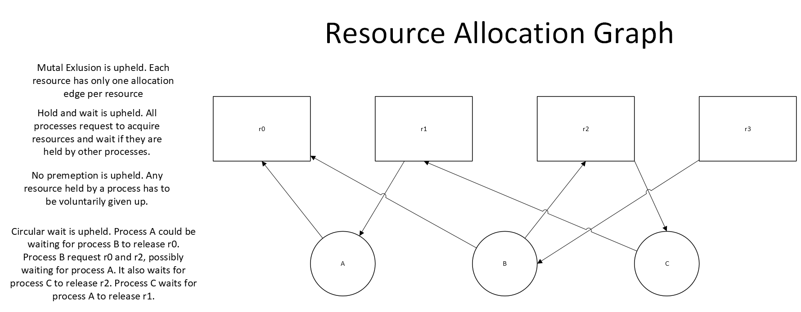

Analysis and resource allocation graph in graph-and-analysis.png

     
     
'

## Getting it to deadlock.

I ran it multiple times and got these deadlocked states
<pre>
Output 1

Testing Deadlock...
A started
C started
--C locks rsc 2
B started
--B locks rsc 3
--B locks rsc 0
--A locks rsc 1
</pre>
<pre>
Output 2

Testing Deadlock...
A started
B started
--B locks rsc 3
--A locks rsc 1
C started
--C locks rsc 2
--B locks rsc 0
</pre>
